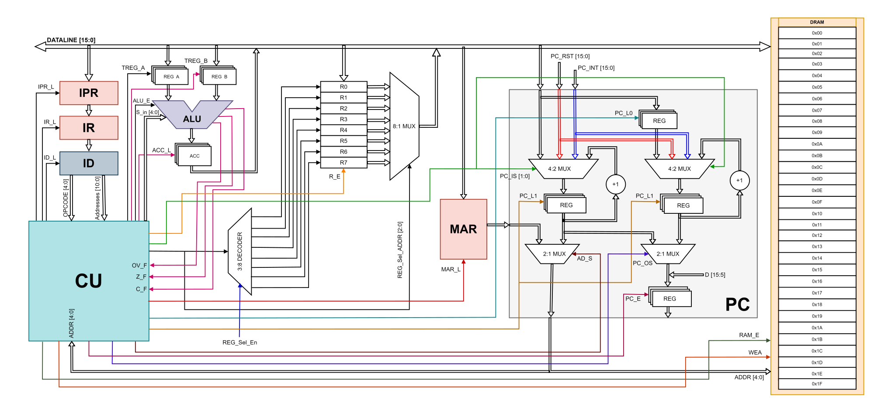
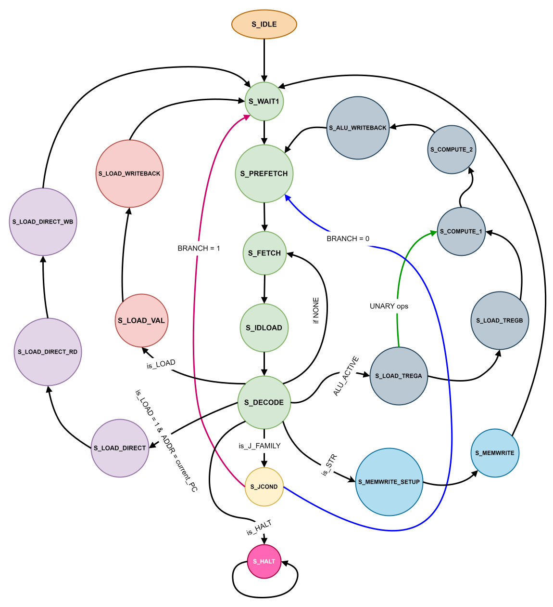

# 16-bit-Multicycle-CISC-Processor
The Processor is a 16-bit CISC CPU with 5-bit address space with three operand register instructions. The instructions are 16-bit and Datapath is 16-bits wide. The processor is a multi cycle processor which does fetch, decode, execution, and write steps sequentially in multiple cycles.

It is a assignment of Processor System Design (PSD) course at IISc.

### Architecture 

### FSM controller

To view the report click here 👉 [PSD Assignment 01 27002](./PSD_Assignment_01_27002.pdf)
